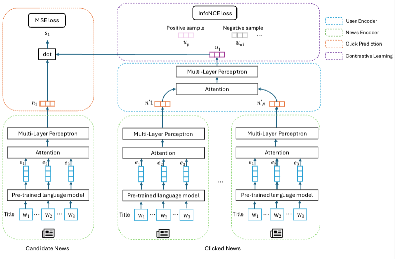

This repository contains the code for the paper [*News, With a Twist: Using Contrastive Learning to Improve User Embeddings for Diverse News Recommendations*](followupsoon) published in the **The 13th International Workshop on News Recommendation and Analytics (INRA 2025)** held as part of the ACM recommender systems conference (RecSys).

## Abstract

News recommender systems (NRS) play a key role in delivering personalised content in fast-paced, high-volume environments. However, models optimised solely for accuracy often overlook important societal objectives such as fairness and diversity, leading to over-personalisation, biased exposure, and narrow content consumption.
In this paper, we propose a contrastive learning framework for improving user representations in neural news recommendation.\footnote{Our code is publicly available at: \url{}} We build upon a bi‑encoder architecture and introduce self-supervised objectives that group semantically related news items by theme, encouraging the model to bring similar items closer in the embedding space while pushing dissimilar ones apart. This strategy mitigates embedding collapse and guides the model toward producing recommendations with broader topical coverage.

We evaluate our approach on the MIND dataset, comparing against state-of-the-art neural models, including LSTUR and NAML. 
Our results show that the proposed method achieves competitive accuracy and yields measurable improvements in beyond-accuracy objectives, particularly in content diversity and exposure fairness. 
Our results demonstrate the potential of contrastive learning to support more balanced and responsible news recommendations.

 Our overall architecture can be seen in the figure below. 

 


### Installation 

To use this code, clone the repo, and create a fresh Python environment. 
Then inside the cloned directory, run:

```
$ pip install .
```

### Datasets

The [Microsoft News Dataset (MIND)](https://msnews.github.io) is an English resource created from logs of the Microsoft News (MSN) website. We use its large version containing approximately 1m users and 160k news. To use our code together with this dataset, you need to download it and run the `xnrs.data.make_mind_dataset.py` script for pre-processing.

### Training

This work extends the paper [*Explaining Neural News Recommendation with Attributions onto Reading Histories*](https://dl.acm.org/doi/10.1145/3673233) published in the **ACM TIST** special issue on responsible recommender systems. [*GitHub*](https://github.com/lucasmllr/xnrs)

## Citation

Please cite our paper:

```bibtex
@article{Tang2025News,
    author = {Zijie Tang, Manel Slokom},
    title = {News, With a Twist: Using Contrastive Learning to Improve User Embeddings for Diverse News Recommendations},
    year = {2025},
    publisher = {CEUR},
    journal = {The 13th International Workshop on News Recommendation and Analytics (INRA 2025)},
}
```
