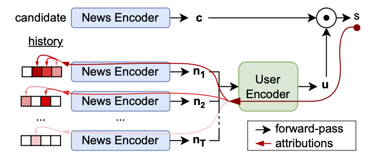
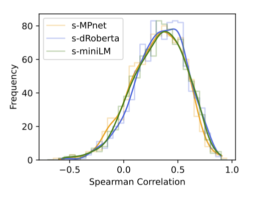

# eXplainable News Recommender Systems

This repository contains the code to the paper [*Explaining Neural News Recommendation with Attributions onto Reading Histories*](https://dl.acm.org/doi/10.1145/3673233) published in the **ACM TIST** special issue on responsible recommender systems.

## Main Results

### Method

 Content-based neural news recommender systems typically consist of a news and a user encoder. They implement a dual encoder architecture and match users' reading histories with candidate news recommendations as shown in the schema below (details in Section 3.1 of the paper). 
 We propose an explainability method for these recommenders that can attribute individual recommendations back onto the reading history of a given user. It can point out which news in a user's reading history were relevant for a given recommendation (red arrows below, detail in Section 3.2).

 {: style="max-width: 250px;"}

 Our explanations can be visiualized as below:


Here the candidate news at the top (in bold) is recommended with a score of 0.577 (max. is one) to the user with the reading history that is listed below. History news are ordered by how much they affect the given recommendation from top to bottom. Their individual attributions (left collumn) are theoretically guaranteed to sum to the overall recommendation score. 
We can break down the news level attributions further onto a token level visualized by the red saliency map. In this example our method clearly shows that the given recommendation is based on related news about the royals. Unrelated news are ranked at the bottom of the list.

### Analysis

We use our method to evaluate whether content-based news recommenders actually base their decision on related news in users' reading histories. To do this on a large scale we correlate our news level attributions to the predictions of semantic similarity models between a given candidate news and individual history news. The resulting distributions for three different such models are shown below.



In some cases the correlation is quite high, showing that here the model does base its recommendations on semantic relatedness to previously read news. However, in a large fraction of the cases this is also not the case and the model entirely disregards semantic similarity.   

Digging deeper, we find that the recommendation score is heavily driven by a bias that the model encodes into its user and news embeddings. The plot below shows distributions of all user- (oragne) und candidate news (blue) embeddings in the MIND test set:

{: style="max-width: 5000px;"}

We receive this plot by integrating over the rotation around the mean user. It shows that users occupy a relatively narrow range in the embedding space. Candidate news on the other hand spread out to much larger angles from the mean user. As the recommendation score is calculated by a dot product between these embeddings, candidates from the far end of the news distribution always score low, because they are in a large angle to any user. Candidates from the close end of the news distribution, on the other hand, can score high (subject to rotation).

For all details, please read the paper.

## Getting Started

### Installation 

To use this code, clone the repo, create a fresh python environment. 
Then inside the cloned directory, run:

```
$ pip install .
```

### Demos

The top level of the repository contains two demo notebooks. 

The `demo_imaginary_data.ipynb` notebook works with imaginary news that you can type in or copy from somewhere. It loads our explainable model trained on the English MIND dataset and is probably the easiest entry point as it doesn't require any data pre-processing.

The `demo_mind_data.ipynb` notebook loads the pre-processed MIND dataset and samples real reading sessions from its test set.
To use this notebook you have to download the MIND dataset first and run the `xnrs.data.make_mind_dataset.py` script to pre-processes it including the pre-computation of transformer embeddings for the contained news. This will take a while.

### Model Weights

We provide the weights for two pre-trained models. Both use our standard architecture (details in Section 3.1 in the paper). You can download the checkpoints by clicking the below links or use the `xnrs.models.get_checkpoint()` method in code (as it is done in the demos):

- [xnrs_mind](https://www2.ims.uni-stuttgart.de/data/xnrs/xnrs_mind_checkpoint.zip) is trained on the English MIND dataset.
- [xnrs_adressa](https://www2.ims.uni-stuttgart.de/data/xnrs/xnrs_adresse_checkpoint.zip) is trained on the Norwegian Adressa dataset.


### Datasets

We train and compare our models, all ablations and a number of previously published models on two publicly available news consumption datasets:

The [Microsoft News Dataset (MIND)](https://msnews.github.io) is an English resource created from logs of the Microsoft News (MSN) website. We use its large version containing approximately 1m users and 160k news. To use our code together with this dataset, you need to download it and run the `xnrs.data.make_mind_dataset.py` script for pre-processing.

The [Adressa](https://reclab.idi.ntnu.no/dataset/) dataset comes from the Norwegian news provider with the same name and its language is Norwegian. We also use its large version (10 weeks). Unlike MIND it is not pre-structured. Therefore, to make the results comparable we structure it in the same way (detail in Section 4.1 of the paper). All pre-processing to make this dataset usable is done by the `xnrs.data.make_adressa_dataset.py`.

### Training

The `train.py` script runs a training for a configuration defined in a config.yaml file. Two exaples of config files for our standard archtiecture and both the MIND and Adressa dataset are included in the `configs/` directory.
Before starting a training, make sure that the paths to the dataset and experiment directories are correct. You can then start a training from a given config using the `--config` flag:

```
$ python train.py --config <path/to/the/config/file.yml>
```

As explained in Section 3.2 of the paper, we use an MSE objective for our trainings that is implemented through the `xnrs.training.MSERankingTrainer`. We also provide the `xnrs.training.BCELogitsRankingTrainer` class implementing a standard BCE objective, which should, however, not be used in combination with the explainable models. We do not experience any performance difference between the two.

## Citation

If you use this code for academic work, please cite our paper:

```bibtex
@article{
    moeller24b,
    author = {M\"{o}ller, Lucas and Pad\'{o}, Sebastian},
    title = {Explaining Neural News Recommendation with Attributions onto Reading Histories},
    year = {2024},
    publisher = {Association for Computing Machinery},
    address = {New York, NY, USA},
    issn = {2157-6904},
    url = {https://doi.org/10.1145/3673233},
    doi = {10.1145/3673233},
    journal = {ACM Trans. Intell. Syst. Technol.},
    month = {jun},
}
```